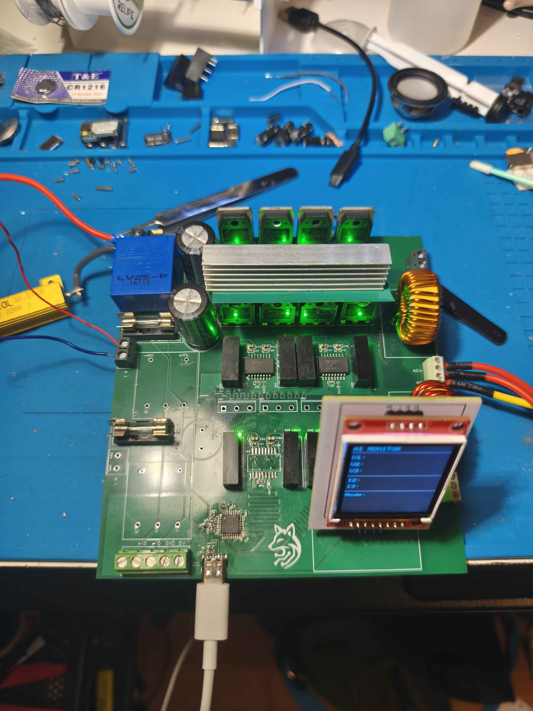

# DC-DC-isolated-bidirectional-Converter-Multiport

Notes:
2 boards.
1-> The multiport itself
2-> the screen which serves as a wireless controller (can start stop, and be upgraded to also alter values of the multiport)

